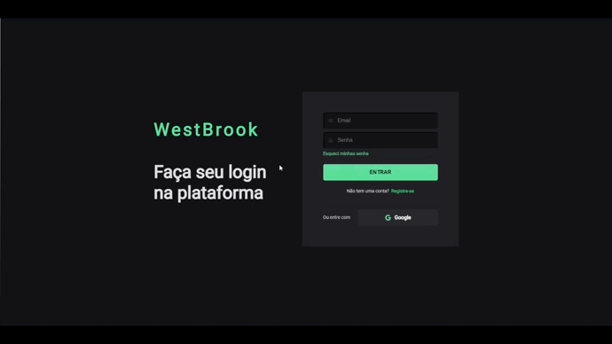
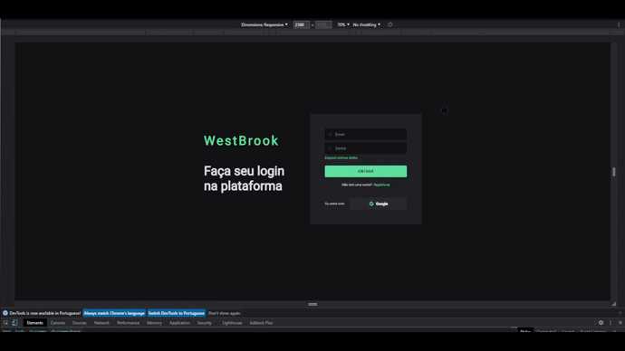

# Primeiro Projeto

About project ...

    <a href="#inicio">Início</a> ●
    <a href="#sobre">Sobre</a> ●
    <a href="#tecnologias">Tecnologias</a> 

# Inicio

<h1 align="center">
    
    
</h1>

# Sobre

Desde o começo estava à procura de fazer um página de login, que nada mais é
que a porta de entrada de algum site, fazer uma página inicial atrativa na minha visão
faz total diferença, porque a pessoa que está acessando ela vai notar que é algo feito
com carinho, e como a pessoa que fez se empenhou pra isso.
 

Na criação senti dificuldades na hora de editar os input's que deu muito trabalho no começo mas com o passar do tempo eu consegui até dar um jeito.  

Agora uma coisa que me pegou foi na página index, essa ai <strong>MEUDEUSDOCÉU</strong>, na parte do <strong>Google</strong> eu não tava conseguindo trocar o plano de fundo e trocar a cor do SVG, e tava dando alguma coisa que trocava somente o fundo do SVG e não do link inteiro, passei mais tempo nisso do que montando o site em sí, mas depois vi o quão tosco era meu erro e acabei conseguindo.
  
Foi meu primeiro contato com media queries eu me assustei mas peguei o jeito rápido, sinto que levei meu responsivo a outro nível botando esse site em prática.

 

# Tecnologias

    
    

          